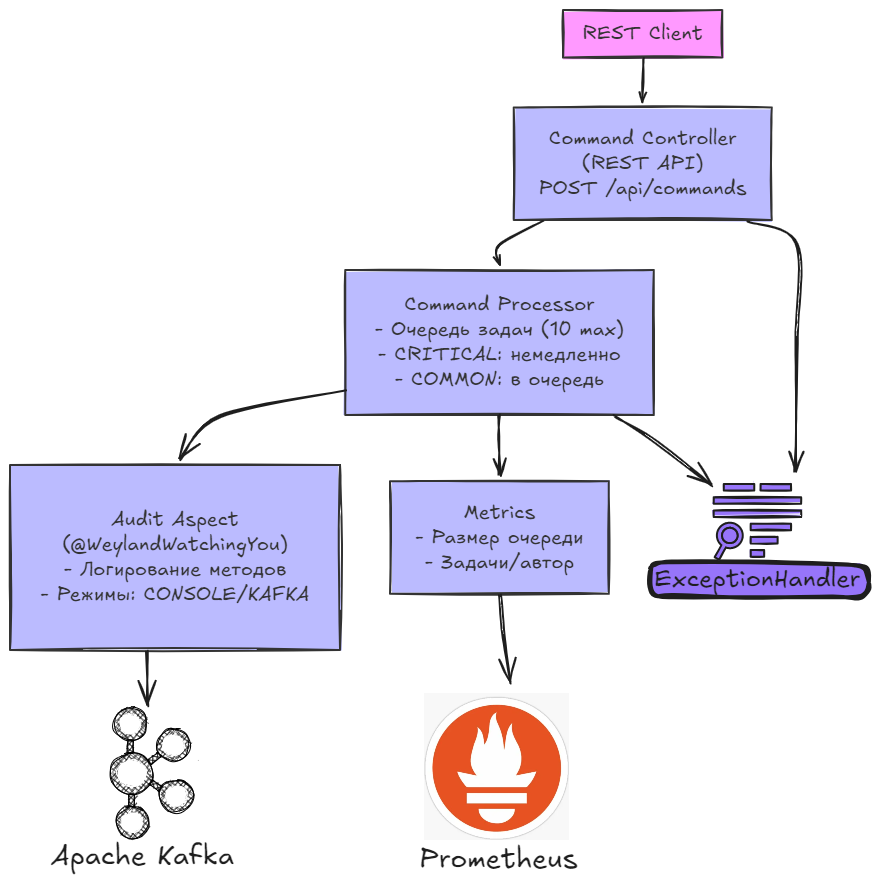

**Synthetic Human Core Starter** — это ядро для управления андроидами (синтетиками), которое:
- Принимает команды от операторов
- Обрабатывает их с разными приоритетами
- Ведёт аудит всех действий
- Мониторит загрузку системы
- Обрабатывает ошибки

---

### **Технологический стек**
```
Spring Boot 3
├─ Spring Web (REST)
├─ Spring Kafka
├─ Spring AOP (аспекты)
├─ Micrometer (метрики)
└─ Lombok
```

### **Диаграмма компонентов**

---

### **Ключевые компоненты**

#### **A. Command Controller (REST API)**
- **Что делает**: Принимает команды в формате:
  ```json
  {
    "description": "Проверить двигатели",
    "priority": "CRITICAL",
    "author": "Рипли",
    "time": "2023-01-01T00:00:00Z"
  }
  ```
- **Пример запроса**:
  ```bash
  curl -X POST http://localhost:8080/api/commands -H "Content-Type: application/json" -d '{"description":"Check engines","priority":"CRITICAL","author":"Ripley","time":"2023-01-01T00:00:00Z"}'
  ```

#### **B. Command Processor**
- **Логика работы**:
  ```
  if (priority == CRITICAL) → выполнить немедленно
  else → добавить в очередь (макс. 10 команд)
  ```
- **Потоки**:
    - Главный поток: принимает команды
    - Фоновый поток: обрабатывает очередь

#### **C. Audit Aspect**
- **Как работает**:
  ```java
  @WeylandWatchingYou(mode = AuditMode.KAFKA)
  public String criticalOperation() { ... }
  ```
  Логирует:
    - Имя метода
    - Параметры
    - Результат
    - Время выполнения

#### **D. Kafka Integration**
- Отправляет аудит-логи в топики:
    - `android-audit` — успешные операции
    - `android-audit-errors` — ошибки

#### **E. Мониторинг**
- Метрики доступны на:
  ```
  http://localhost:8080/actuator/metrics
  http://localhost:8080/actuator/prometheus
  ```
  Собирает:
    - Размер очереди команд
    - Количество выполненных задач

---

### **4. Пример Workflow**

1. **Оператор** отправляет команду через REST API
2. **Система**:
    - Валидирует команду
    - CRITICAL → выполняет сразу
    - COMMON → ставит в очередь
3. **Аудит**:
    - Записывает действие в Kafka/консоль
4. **Мониторинг**:
    - Обновляет метрики (очередь, performance)